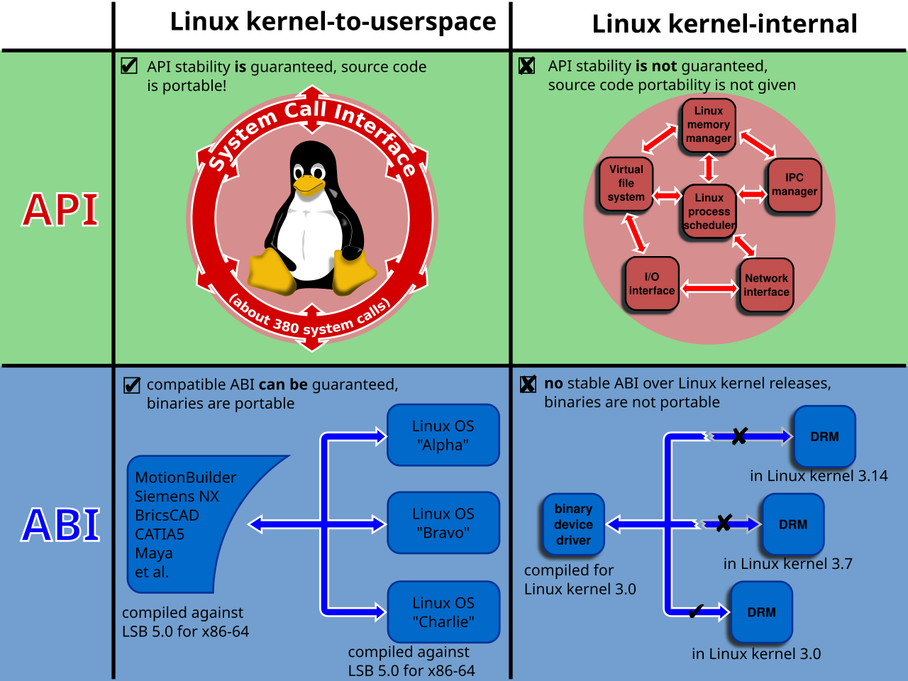

# 摘要{-}

C++模板元编程（Template Metaprogramming）是一种利用C++模板系统进行编程的技术。通过在编译时进行计算和推导，模板元编程使得程序在运行时更高效，同时也能使程序更加灵活和通用。它常用于类型推导、编译时常量计算、静态断言和优化等方面。本文将详细介绍C++模板元编程的基础概念、常见技巧以及实际应用。

# 什么是模板元编程？

模板元编程是指在C++中使用模板（尤其是模板特化、SFINAE、递归模板等）进行的编程方式。通过这种方式，开发者可以在编译阶段进行大量的计算和优化。模板元编程的核心思想是将计算过程从运行时转移到编译时，达到提高程序执行效率的目的。

## 模板和模板实例化

C++中的模板是一种泛型编程工具，允许在类或函数定义时指定类型或值作为参数。模板实例化是指根据实际参数生成具体的类或函数。例如：

```cpp
template <typename T>
T add(T a, T b) {
    return a + b;
}

int main() {
    int sum = add(3, 4); // 此时会实例化出 add<int>
}
```

## 编译时常量计算

模板元编程的一个经典应用是通过模板进行编译时常量计算。这使得程序在运行时可以避免不必要的计算，提高效率。

| 方式             | 语法示例             | 是否可修改原始变量 | 是否有拷贝开销 | 常用于                  | 特点与注意事项                                      |
|------------------|----------------------|---------------------|----------------|---------------------------|----------------------------------------------------|
| 按值传递         | `void f(int x)`      | 否                  | ✅ 是           | 小型内建类型             | 会复制参数，修改不会影响原始变量                    |
| 按引用传递       | `void f(int& x)`     | ✅ 是                | ❌ 否           | 需要修改原始变量         | 直接操作原始对象，调用者可见修改                    |
| 常量引用传递     | `void f(const int& x)` | 否                | ❌ 否           | 大对象只读               | 避免复制，保护原始对象不被修改                      |
| 指针传递         | `void f(int* x)`     | ✅ 是（非空指针）    | ✅（视情况而定）| 需要处理可空对象         | 需检查指针有效性，可模拟引用功能                    |
| 右值引用传递     | `void f(int&& x)`    | ✅ 是（可移动资源）  | ❌ 否（移动）   | 移动语义实现、完美转发   | 只能绑定到右值，常与 `std::move` 和模板配合使用     |

: 表格示例 {#tbl:pass}

我引用[@tbl:pass]
例如，计算阶乘：

```cpp
template <int N>
struct Factorial {
    static const int value = N * Factorial<N-1>::value;
};

template <>
struct Factorial<0> {
    static const int value = 1;
};
```

通过模板递归，可以在编译时计算阶乘的值。对于`Factorial<5>::value`，编译器会直接给出结果`120`。

## 编译时类型推导

C++模板元编程还可以实现编译时类型推导。例如，可以通过`std::is_same`判断两个类型是否相同：

```cpp
#include <type_traits>

template <typename T, typename U>
struct IsSame {
    static const bool value = std::is_same<T, U>::value;
};
```

这段代码会在编译时计算出两个类型是否相同，并将结果存储为`value`。

# 常见的模板元编程技巧

## 模板特化

模板特化是模板元编程中常用的技巧。它允许开发者为特定的类型或值提供不同的实现。这种方式可以用于优化代码，或者处理一些特殊的边界情况。

例如：

```cpp
template <typename T>
struct Print {
    void operator()() { std::cout << "Generic type\n"; }
};

template <>
struct Print<int> {
    void operator()() { std::cout << "Integer type\n"; }
};
```

对于`Print<int>`，编译器会使用特化版本，而对于其他类型则使用默认版本。

## SFINAE（Substitution Failure Is Not An Error）

SFINAE是模板元编程中的一种技术，它使得模板选择更加灵活。通过SFINAE，可以根据模板参数的特性选择不同的实现，而不是仅仅因为模板实例化失败而导致编译错误。

```cpp
template <typename T>
auto has_begin(T&& t) -> decltype(std::begin(t), std::true_type{}) {
    return std::true_type{};
}

template <typename T>
std::false_type has_begin(...) {
    return std::false_type{};
}
```

通过`decltype`和`std::begin`，可以判断一个类型是否具有`begin`函数，并根据结果选择不同的实现。

{#fig:abi}

# 模板元编程的实际应用

## 编译时常量计算

如前所述，模板元编程常用于计算常量。这种计算通常是递归计算、常量表达式求值等。

例如，计算一个数的斐波那契数列：

```cpp
template <int N>
struct Fibonacci {
    static const int value = Fibonacci<N-1>::value + Fibonacci<N-2>::value;
};

template <>
struct Fibonacci<0> {
    static const int value = 0;
};

template <>
struct Fibonacci<1> {
    static const int value = 1;
};
```

通过模板递归，`Fibonacci<10>::value`可以在编译时计算出结果。

## 静态断言（`static_assert`）

模板元编程也常用于编写静态断言。`static_assert`允许开发者在编译时对某些条件进行检查，以确保程序符合预期。

```cpp
template <typename T>
void check_integral() {
    static_assert(std::is_integral<T>::value, "T must be an integral type");
}
```

## 类型推导与反射

模板元编程还可以与C++类型推导和反射机制结合使用，进行更加复杂的类型推断和分析。通过模板类，可以实现对类型的自动识别和处理。

# 公式演示

在C++模板元编程中，常常需要进行一些数学计算或常量推导，以下是一些常见的公式演示：

## 阶乘公式

阶乘是模板元编程中的经典例子。阶乘公式为：

$$ n!=n×(n−1)!n! = n \times (n-1)! $$

其中，当 n=0 时，0!=1。

在模板元编程中，阶乘的实现方式如下：

```cpp
template <int N>
struct Factorial {
    static const int value = N * Factorial<N-1>::value;
};

template <>
struct Factorial<0> {
    static const int value = 1;
};
```

## 斐波那契数列

斐波那契数列的公式为：

$$F(n)=F(n−1)+F(n−2) $$

其中，F(0)=0，F(1)=1。

在模板元编程中的实现方式如下：

```cpp
template <int N>
struct Fibonacci {
    static const int value = Fibonacci<N-1>::value + Fibonacci<N-2>::value;
};

template <>
struct Fibonacci<0> {
    static const int value = 0;
};

template <>
struct Fibonacci<1> {
    static const int value = 1;
};
```

通过这种方式，可以在编译时计算斐波那契数列的值。

{#fig:abi_dup}

# 结论

C++模板元编程是一种强大的编程技术，能够在编译时进行高效的计算和类型推导，提升程序的性能和可维护性。通过模板特化、SFINAE、递归模板等技巧，开发者可以实现更加复杂和高效的编程模式。然而，模板元编程的复杂性也意味着它需要较高的学习曲线。掌握它的应用对于编写高效、通用和可扩展的C++代码至关重要。
